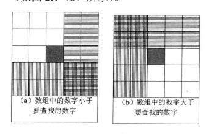

# 二维数组中的查找

____

## 题目描述

在一个二维数组中（每个一维数组的长度相同），每一行都按照从左到右递增的顺序排序，每一列都按照从上到下递增的顺序排序。请完成一个函数，输入这样的一个二维数组A和一个整数a，判断数组中是否含有该整数。

____

## 解法

### v-0.0



直观想法：对于数组中选取一个数字A[i,j]，与查找数字a做对比，如果A[i,j]比较小，那么候选区域在A[i,j]的右方和下方，如果A[i,j]比较大，那么候选区域在A[i,j]的上方和左方。

那么可以得出以下几条性质：

1. **a与A[i,j]做比较之后，可以排除一个左上角A[:i,:j]或者右下角区域A[i:,j:].**
2. **如果a小于矩阵的左上角或者大于右下角，那么a一定不在这个这个矩阵中**
3. **矩阵的左上角是矩阵的最小值，矩阵的右下角是矩阵的最大值**

利用性质1，从左上角开始，那么每次排除一个A[i,j]的左上角之后，剩余区域可以分为A[1:i,j+1:n]和A[i+1:m,1:j]和A[i+1:j+1]，对这三个区域进行相同方法的求解即可，即递归调用。

时间复杂度：需要遍历每个元素，大致估计是$O(n^2)$.

### v-0.1

方法0.0每次只能排除一个区域的元素，并且由于是从左上角开始，区域就更小了。

先在数组A的对角线上通过二分法找到A[i,i]和A[i+1,i+1]，其满足$A[i,i]<a<A[i+1,i+1]$，这样可以最少去掉一半的元素，只剩下左下角和右上角的矩阵。

### v-0.2

方法0.1对于接近方阵效果比较好，当待对比数组是长方形矩阵时，可以排除的元素就会大大减少。所以方案修改为：

比较数组A的对角线长度(A[i,i]的形式)、长、宽三者的长度，选取最长的一条。

如果选取的是对角线，通过二分法找到A[i,i]和A[i+1,i+1]，其满足$A[i,i]<a<A[i+1,i+1]$。

如果选取的是长或者宽，那么通过二分法找到A[i,j]和A[i+1,j]，其满足$A[i,j]<a<A[i+1,j]$，这个时候虽然只能删掉下面区域的元素和上面元素的最左边一列的元素，但是如果特别狭长，那么删除的元素也是比较多的。

备注：

初步证明当长宽比大于4:3时，应该选长边，反之应该选斜边。

### v-0

根据v-1.0的比较方法，将v-0的方法总结为：

从二维数组的对角线开始查找：

* 若元素值等于a，返回true
* 若元素值小于target，继续查找下一个对角线元素，++i，++j
* 若元素值大于target，砍掉左上区域元素和右下区域元素

### v-1.0

以上思路都是在以从左上方开始查找为主线，作者给的思路是从右上角开始比较，这样每次都至少能删除一列或者一行，或者说

* **A[1,1:n] A[1:n,n]也是一个有序数组，而且右上角(或者左下角)是一个类中点**

其时间复杂度是$O(n)$

v-0版本的有序数组是对角线，好像复杂度也差不多。

这样每次都可以删除一半的元素，而且不用考虑那么复杂的边界条件和判断条件

### v-1

从二维数组的右上方开始查找：

* 若元素值等于 `target`，返回 `true`；
* 若元素值大于 `target`，砍掉这一列，即 `--j`；
* 若元素值小于 `target`，砍掉这一行，即 `++i`。

也可以从二维数组的左下方开始查找，以下代码使用左下方作为查找的起点。

注意，不能选择左上方或者右下方的数字，因为这样无法缩小查找的范围。

```java
public class Solution {
    /**
     * 二维数组中的查找
     * @param target 目标值
     * @param array 二维数组
     * @return boolean
     */
    public boolean find(int target, int[][] array) {
        if (array == null) {
            return false;
        }
        int rows = array.length;
        int columns = array[0].length;

        int i = rows - 1;
        int j = 0;
        while (i >= 0 && j < columns) {
            if (array[i][j] == target) {
                return true;
            }
            if (array[i][j] < target) {
                ++j;
            } else {
                --i;
            }
        }
        return false;
    }
}
```

## 测试用例

1. 二维数组中包含查找的数字（查找的数字是数组中的最大值和最小值；查找的数字介于数组中的最大值和最小值之间）；
2. 二维数组中没有查找的数字（查找的数字大于/小于数组中的最大值；查找的数字在数组的最大值和最小值之间但数组中没有这个数字）；
3. 特殊输入测试（输入空指针）。

## 牛客网

v-0 189 ms 17852 k
v-1 171 ms 16040 k

两个差不多，但是v-1的代码却要简单很多，边界也少考虑很多。

不得不说，作者就是作者。

```python
# -*- coding:utf-8 -*-
class Solution:
    # array 二维列表
    def Find(self, target, array):
        if array == [[]] or len(array[0]) < 0:
            return False

        row = len(array)
        col = len(array[0])

        i = row -1
        j = 0

        if array[0][0] > target and array[row-1][col-1] < target:
            return False

        while (i>=0 and j<col) :
            if array[i][j] == target :
                return True
            if array[i][j] < target :
                j=j+1
            else:
                i=i-1
        return False
```
